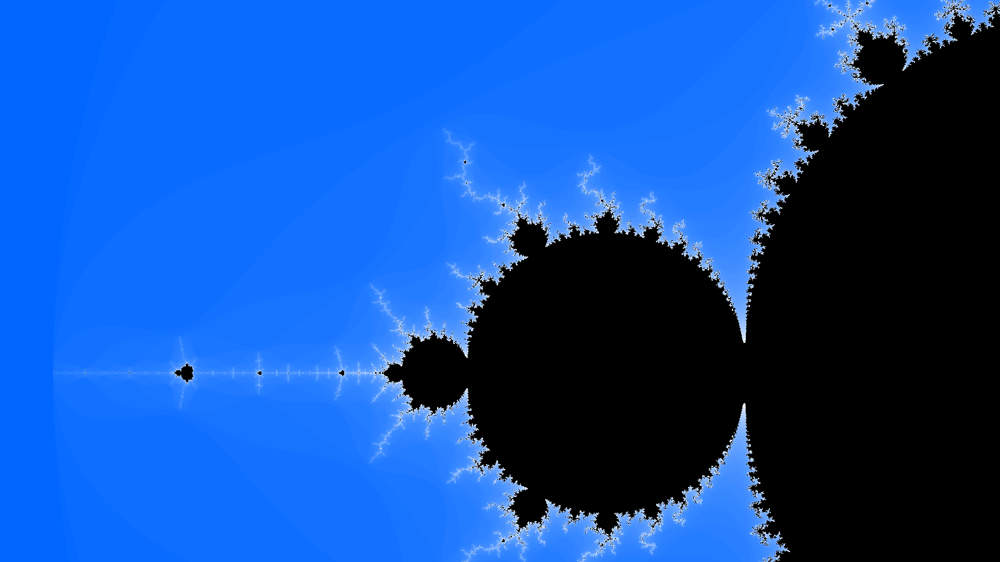

# Mandelbrot Viewer

A small project using OpenGL to view and navigate the [Mandelbrot Set](https://en.wikipedia.org/wiki/Mandelbrot_set).

## Controls

| Action               | Button      |
| -------------------- | ----------- |
| Zoom In              | W           |
| Zoom Out             | S           |
| Move Up              | Up Arrow    |
| Move Down            | Down Arrow  |
| Move Left            | Left Arrow  |
| Move Right           | Right Arrow |
| Increase Iterations* | R           |
| Decrease Iterations* | F           |
| Terminate Program    | Esc         |

*Maximum number of iterations used to determine if a coordinate is divergent or not. Increases/Decreases fractal detail.